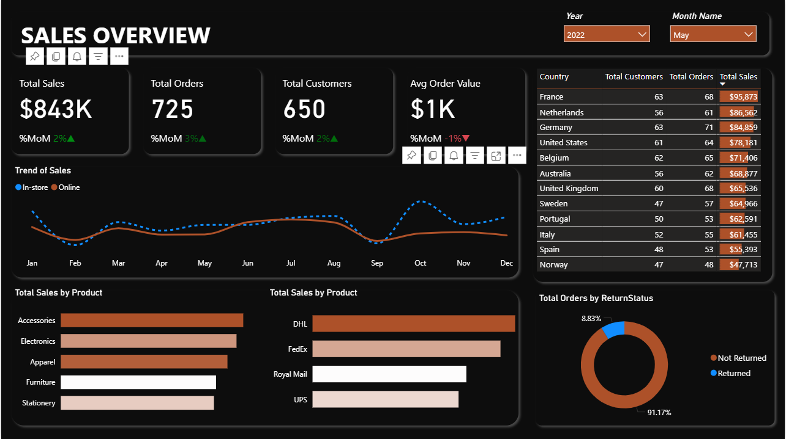

# 📈 Sales Dashboard

An interactive and visually appealing **Sales Dashboard** built using **Power BI**, designed to monitor sales KPIs, customer trends, and regional performance with real-time filtering and dynamic visuals.



---

## 🔍 Key Insights

- 💰 **Total Sales:** $843K  
- 📦 **Total Orders:** 725  
- 🧑‍🤝‍🧑 **Total Customers:** 650  
- 🧾 **Average Order Value:** $1,000  
- 🟢 **Month-over-Month Growth:**
  - Sales: +2%
  - Orders: +3%
  - Customers: +2%
- 🔻 Avg Order Value: -1% MoM

### 🌐 Top 5 Countries by Sales:
| Country       | Total Sales |
|---------------|-------------|
| France        | $95,873     |
| Netherlands   | $86,562     |
| Germany       | $84,859     |
| United States | $78,181     |
| Belgium       | $71,406     |

### 📦 Product Category Sales:
- **Accessories:** Highest performing category  
- **Electronics & Apparel:** Strong and consistent contributors  
- **Stationery:** Lowest in volume  

### 🚚 Shipping Partners by Sales:
- **Top Carrier:** DHL  
- Followed by FedEx, Royal Mail, and UPS

### 🔄 Order Return Rate:
- **Returned Orders:** 8.83%  
- **Not Returned:** 91.17%

---

## 💡 Features

- Dynamic filtering by **Year** and **Month**
- Separate trends for **In-store vs. Online Sales**
- Breakdown by **Product**, **Country**, **Carrier**, and **Return Status**
- KPI tracking: Total Sales, Orders, Customers, AOV
- Dark theme for better readability and professional look

---

## 🛠 Tech Stack

- **Power BI** – For data modeling and visualization
- **Excel/CSV** – Data source
- **DAX** – Used for calculated metrics and KPIs
- **Slicer Filters** – For year/month selection

---


---

## 🔧 How to Use

1. Clone the repository:
   ```bash
   git clone https://github.com/yourusername/sales-dashboard.git

2.Open dashboard.pbix in Power BI Desktop.
3.Refresh data or link your own dataset.
4.Customize filters and visuals as needed.

